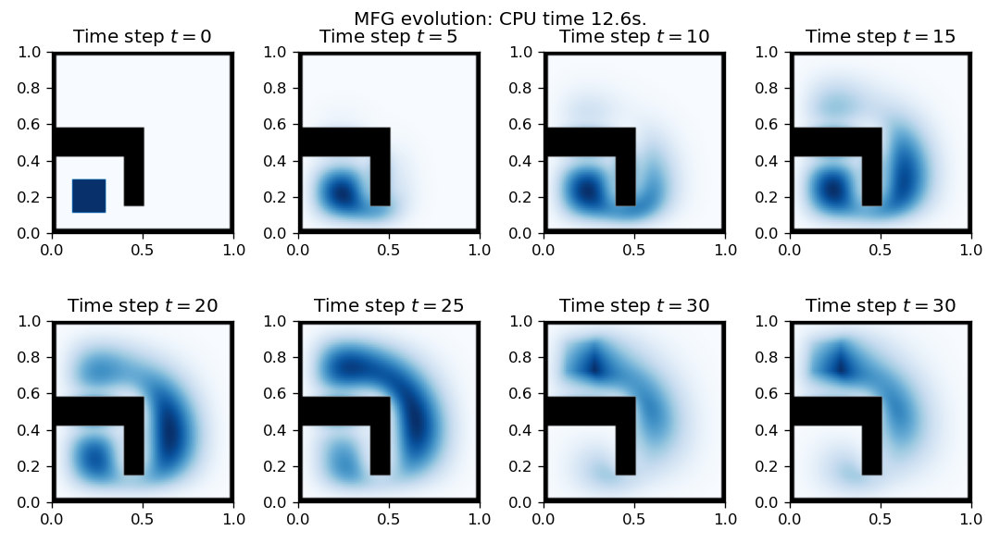

# Entropic variational mean-field games

This C++ library implements methods for solving second order variational mean-field games using an entropy minimization approach. Comes with Python bindings using [Pybind11](https://github.com/pybind/pybind11).

This is a rewrite of my own Python/Cython implementation: https://github.com/ManifoldFR/mva-optimaltransport/tree/master/project.




## Dependencies

We use the powerful [C++ `matplotlib` bindings](https://github.com/lava/matplotlib-cpp). Grab the header with wget:

```bash
wget https://raw.githubusercontent.com/lava/matplotlib-cpp/master/matplotlibcpp.h
```

## References

* Jean-David Benamou, Guillaume Carlier, Simone Marino, Luca Nenna. An entropy minimization approach to second-order variational mean-field games. 2019. [⟨hal-01848370v4⟩](https://hal.archives-ouvertes.fr/hal-01848370v4)
